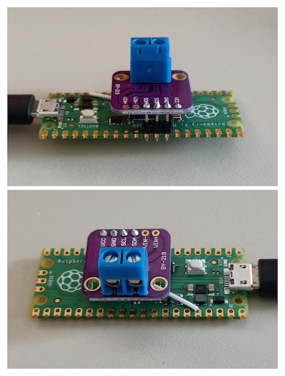

# PicoVA

Firmware for a 
[Raspberry Pi Pico](https://www.raspberrypi.com/documentation/microcontrollers/raspberry-pi-pico.html) 
to read current/voltage/power from an
[INA219](https://www.ti.com/product/INA219). 
This makes for a dirt-cheap power meter – you can get a Pico for NZ$7 and an
INA219 module with a shunt resistor for NZ$3.

The firmware reads from the INA219 as fast as possible and transmits the
measurements over USB-CDC. It initially selects the smallest bus and shunt
ranges for highest precision and automatically increases the ranges if the
current or voltage clips. Currently the ADC resolution is hard-coded but I may
add a configuration interface over USB at some point.

There's a fairly simple Python script to run on the host to plot the received
data in real time. 

